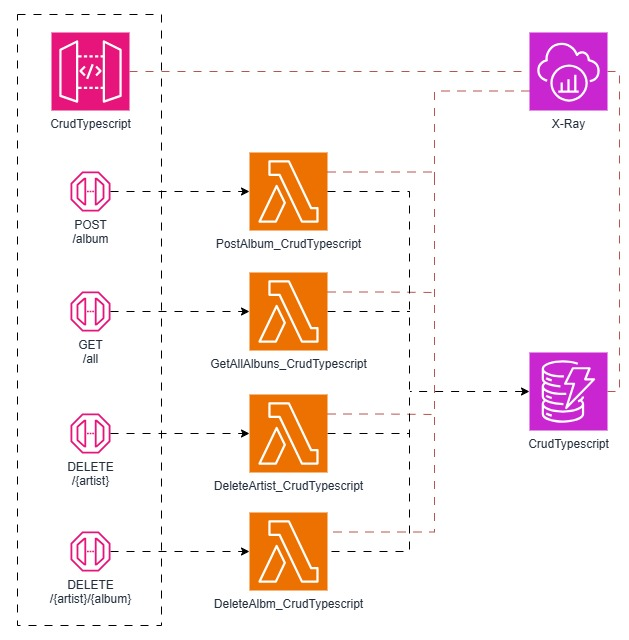
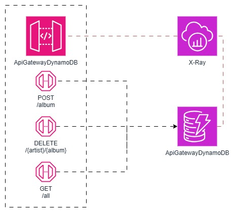

# CDK-EXAMPLES

## crud-typescript

## apigateway-dynamodb

## Stack001GO

* cd lib/Stack001GO
* mkdir functions
* mkdir functions/post
* cd functions/post
* go mod init post
* go get github.com/aws/aws-sdk-go-v2/service/dynamodb
* go get github.com/aws/aws-sdk-go-v2/config
* go get github.com/aws/aws-lambda-go/lambda

* x86_64: GOOS=linux GOARCH=amd64 go build -o bin/bootstrap
* ARM64: GOOS=linux GOARCH=arm64 go build -o bin/bootstrap

## Stack001RS
* cd lib/Stack001RS
* mkdir functions
* cargo lambda new post
* cargo add aws_config aws_sdk_dynamodb

* cargo add serde --features derive
* cargo add tracing
* cargo add tracing-subscriber --features fmt
* cd post
* cargo lambda build --release --arm64

## Stack001TS