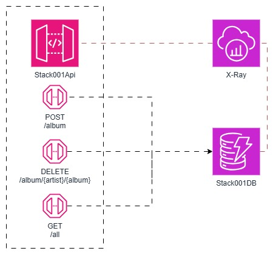
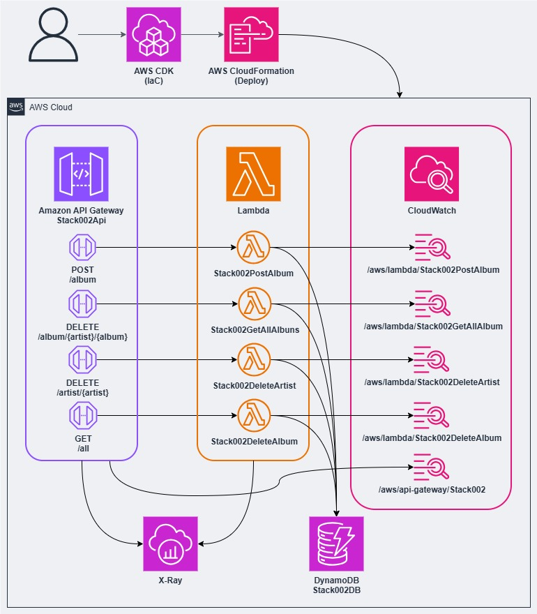
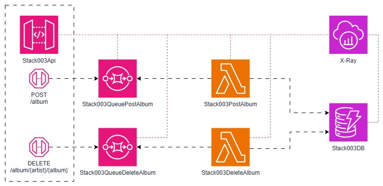
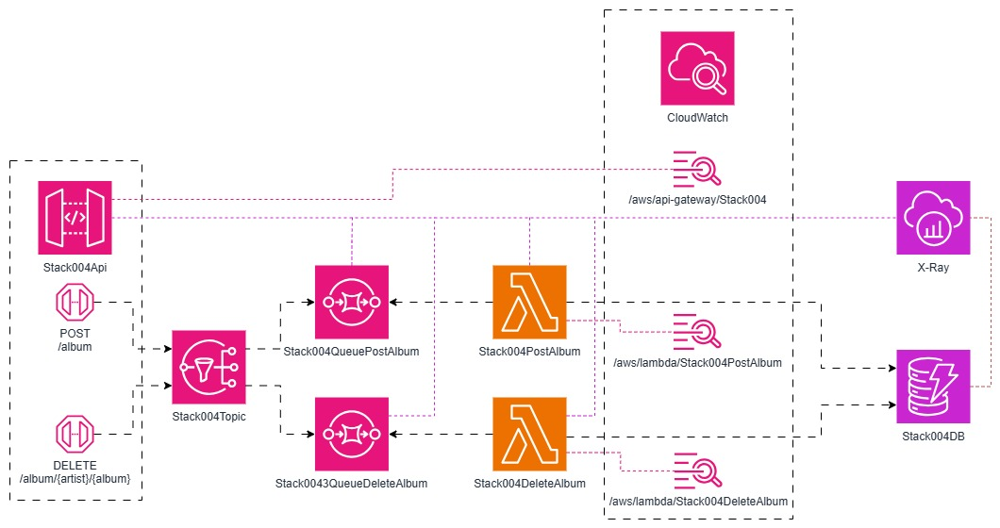

# CDK Examples

Coleção de exemplos práticos de integração entre AWS API Gateway e diferentes serviços AWS usando AWS CDK (Cloud Development Kit).

## 📋 Índice

- [Sobre o Projeto](#sobre-o-projeto)
- [Pré-requisitos](#pré-requisitos)
- [Instalação](#instalação)
- [Estrutura do Projeto](#estrutura-do-projeto)
- [Stacks Disponíveis](#stacks-disponíveis)
- [Como Usar](#como-usar)
- [Exemplos de Payloads](#exemplos-de-payloads)
- [Tecnologias Utilizadas](#tecnologias-utilizadas)

## 🎯 Sobre o Projeto

Este projeto demonstra diferentes padrões de arquitetura serverless na AWS, focando em integrações entre API Gateway e serviços como DynamoDB, Lambda, SQS e SNS. Cada stack implementa um padrão diferente de comunicação e processamento de dados.

## 📦 Pré-requisitos

- Node.js 18+ e npm
- AWS CLI configurado
- AWS CDK CLI instalado (`npm install -g aws-cdk`)
- Credenciais AWS configuradas

## 🚀 Instalação

```bash
# Clone o repositório
git clone <repository-url>
cd cdk-examples

# Instale as dependências
npm install
```

## 📁 Estrutura do Projeto

```
cdk-examples/
├── bin/
│   └── cdk-examples.ts           # Ponto de entrada da aplicação CDK
├── lib/
│   ├── cdk-examples-stack.ts     # Stack principal que orquestra as nested stacks
│   ├── stack001/                 # Stack 1: API Gateway → DynamoDB
│   ├── stack002/                 # Stack 2: API Gateway → Lambda → DynamoDB
│   ├── stack003/                 # Stack 3: API Gateway → SQS → Lambda → DynamoDB
│   ├── stack004/                 # Stack 4: API Gateway → SNS → SQS → Lambda → DynamoDB
│   └── payloads/                 # Arquivos REST para testes
├── test/                         # Testes unitários
└── cdk.json                      # Configuração do CDK
```

## 🏗️ Stacks Disponíveis

### Stack001: API Gateway → DynamoDB

Integração direta entre API Gateway e DynamoDB usando AWS Integration, sem intermediários.

**Características:**
- Integração direta via `AwsIntegration`
- Validação de request body com JSON Schema
- Tracing com X-Ray habilitado
- Logs de acesso no CloudWatch Logs

**Endpoints:**
- `POST /album` - Criar novo álbum
- `DELETE /album/{artist}/{album}` - Deletar álbum
- `GET /all` - Listar todos os álbums



---

### Stack002: API Gateway → Lambda → DynamoDB

Integração assíncrona usando Lambda Functions como intermediário.

**Características:**
- Processamento via Lambda Functions
- Validação de request body
- Tracing com X-Ray
- Logs estruturados com AWS Lambda Powertools

**Endpoints:**
- `POST /album` - Criar novo álbum
- `DELETE /album/{artist}/{album}` - Deletar álbum
- `DELETE /artist/{artist}` - Deletar artista
- `GET /all` - Listar todos os álbums



---

### Stack003: API Gateway → SQS → Lambda → DynamoDB

Padrão de fila de mensagens usando SQS para desacoplamento e processamento assíncrono.

**Características:**
- Mensagens enviadas para SQS via API Gateway
- Processamento assíncrono com Lambda
- Dead Letter Queue (DLQ) para mensagens com falha
- Validação de payload e path parameters
- Tracing com X-Ray

**Endpoints:**
- `POST /album` - Envia payload para SQS (integração direta)
- `DELETE /album/{artist}/{album}` - Envia path parameters para SQS



---

### Stack004: API Gateway → SNS → SQS → Lambda → DynamoDB

Padrão pub/sub usando SNS como message broker com filtros de subscription.

**Características:**
- Publicação no SNS via API Gateway
- Filtros de subscription baseados em MessageAttributes
- Processamento assíncrono via SQS
- Dead Letter Queue (DLQ)
- Tracing com X-Ray
- Logs estruturados

**Endpoints:**
- `POST /album` - Publica mensagem no SNS com MessageAttributes
- `DELETE /album/{artist}/{album}` - Deleta álbum via SNS

**MessageAttributes:**
- `http`: Valor fixo "PostAlbum" usado para filtrar subscriptions no POST
- `http`: Valor fixo "DeleteAlbum" usado para filtrar subscriptions no DELETE

**Filtros:**
- Subscription filtra mensagens com `http=PostAlbum` ou `http=DeleteAlbum`



---

## 💻 Como Usar

### 1. Configurar a Stack Ativa

Edite `lib/cdk-examples-stack.ts` para ativar a stack desejada:

```typescript
export class CdkExamplesStack extends Stack {
  constructor(scope: Construct, id: string, props?: StackProps) {
    super(scope, id, props);

    // Descomente a stack que deseja usar
    // new Stack001NestedStack(this, "Stack001", props);
    // new Stack002NestedStack(this, "Stack002", props);
    new Stack003NestedStack(this, "Stack003", props);
    new Stack004NestedStack(this, "Stack004", props);
  }
}
```

### 2. Deploy da Stack

```bash
# Sintetizar o CloudFormation template
cdk synth

# Verificar diferenças antes do deploy
cdk diff

# Fazer deploy
cdk deploy
```

### 3. Testar os Endpoints

Use os arquivos `.rest` na pasta `lib/payloads/` ou ferramentas como Postman/Insomnia.

**Exemplo com curl:**

```bash
# Substitua {API_ID} pelo ID da sua API
curl -X POST https://{API_ID}.execute-api.us-east-1.amazonaws.com/prod/album \
  -H "Content-Type: application/json" \
  -d @lib/payloads/post_album_1.rest
```

## 📝 Exemplos de Payloads

Os payloads de exemplo estão disponíveis em `lib/payloads/`:

- `post_album_1.rest` - Exemplo completo com tracks
- `post_album_2.rest` - Exemplo alternativo
- `post_album_3.rest` - Exemplo alternativo
- `post_album_4.rest` - Exemplo alternativo
- `delete_album.rest` - Exemplo de DELETE
- `delete_artist.rest` - Exemplo de DELETE artista
- `get_all.rest` - Exemplo de GET

**Formato do payload:**

```json
{
  "artist": "Dream Theater",
  "album": "Images and Words",
  "tracks": [
    {
      "title": "Pull Me Under",
      "length": "8:14"
    }
  ]
}
```

## 🛠️ Tecnologias Utilizadas

- **AWS CDK** - Infrastructure as Code
- **TypeScript** - Linguagem de programação
- **API Gateway (RestApi)** - API REST
- **DynamoDB** - Banco de dados NoSQL
- **Lambda** - Computação serverless
- **SQS** - Fila de mensagens
- **SNS** - Serviço de notificações/pub-sub
- **X-Ray** - Tracing distribuído
- **CloudWatch Logs** - Logs centralizados
- **AWS Lambda Powertools** - Observabilidade e logging

## 📚 Comandos Úteis

```bash
# Compilar TypeScript
npm run build

# Executar testes
npm run test

# Verificar sintaxe do CDK
cdk synth

# Verificar diferenças antes do deploy
cdk diff

# Listar stacks
cdk list

# Fazer deploy
cdk deploy

# Destruir stack
cdk destroy
```

## 🔍 Observabilidade

Todas as stacks incluem:

- **X-Ray Tracing** - Rastreamento distribuído de requisições
- **CloudWatch Logs** - Logs estruturados com AWS Lambda Powertools
- **Access Logs** - Logs de acesso do API Gateway em formato JSON

## 📄 Licença

Este projeto é um exemplo educacional e está disponível para uso livre.

## 🤝 Contribuindo

Contribuições são bem-vindas! Sinta-se à vontade para abrir issues ou pull requests.

---

**Nota:** Lembre-se de configurar suas credenciais AWS e ajustar as regiões conforme necessário antes de fazer o deploy.
